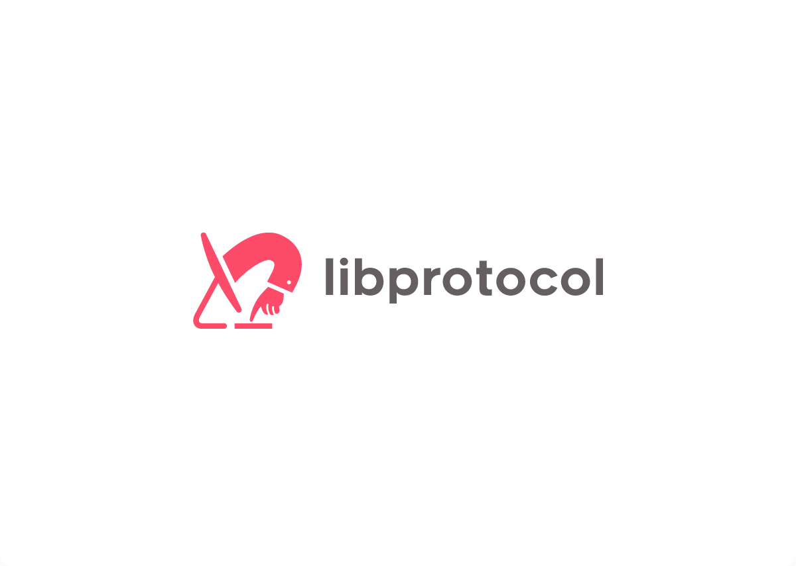

# libprotocol

## Motivation

I want a lightweight and generic (i.e. I/O agnostic) way to define protocols for the go language.
This will enable declarative testing suites and invariant based reasoning.

## License

This project is licensed under the GPL-3 license.
